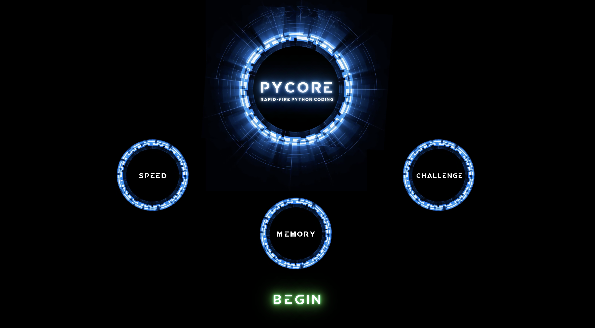
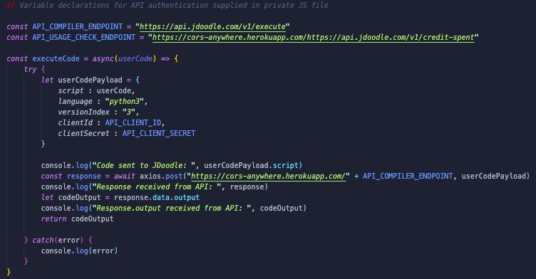

# PyCore

### *by Collin Didier* 

##### [GitHub](https://github.com/CDidier80) | [LinkedIn](https://www.linkedin.com/in/collin-didier-a072a858/) 
##### Project status viewable at [Trello](https://trello.com/b/sE9WqlLd/pycore)

#### Date: 10/17/2020

### Description
#### *A cloud-based Python 3 IDE designed for fast paced coding practice such that user's retain their knowledge and memory of the language's core concepts.*

### Technologies utilized:
* Javascript
* HTML5
* CSS3
* JDoodle API

### User Stories:

As a programmer, I want a a clearly presented selection of coding subject matter to practice on the landing page so I can find material relevant to me
As a programmer, I want an attractive, functional and responsive editor and terminal in which to work.
As a busy programmer, I want to move from question to questionn quickly so I can quickly refresh myself on a wide swath of material in a short time. 
As a busy programmer, I want an intuitive and well organized interface to change difficulty levels and type of subject matter at will. 

### Project Status:

Phase 1 of 2 is complete. The current version is deployed on surge with basic editing/code execution capability. Phase 2 completion scheduled in January 2021.

### Current API Integration:

The current API-integration is handled by sending post requests via public proxy by cors-anywhere. The use of this public proxy 
will be replaced in the near future by an independent and scaleable private proxy. Code execution in the long-term may be migrated to Sphere Engine or may discontinue API integration altogether by deploying a Python compilation sandbox adjacent to a PyCore server. 

### How to get started: 
Visit pycore.com/surge/sh and click "Begin" to navigate to the editor/console. The site currently supports basic, unguided code editing and compilation. 
Look for further feature releases in late 2020 and early 2021.

#### Credits:
JDoodle API for remote code execution
https://www.jdoodle.com/
Ace for embeddable editor
https://github.com/ajaxorg/ace